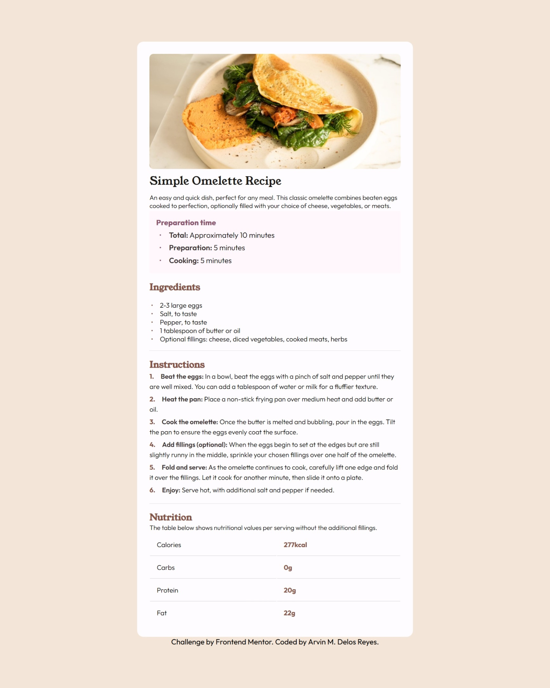
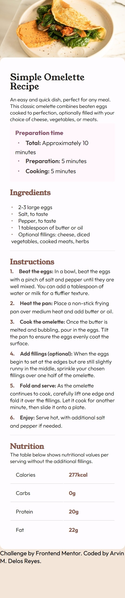

# Frontend Mentor - Recipe page solution

This is a solution to the [Recipe page challenge on Frontend Mentor](https://www.frontendmentor.io/challenges/recipe-page-KiTsR8QQKm). Frontend Mentor challenges help you improve your coding skills by building realistic projects.

## Table of contents

- [Overview](#overview)
  - [The challenge](#the-challenge)
  - [Screenshot](#screenshot)
  - [Links](#links)
- [My process](#my-process)
  - [Built with](#built-with)
  - [What I learned](#what-i-learned)
  - [Continued development](#continued-development)
  - [Useful resources](#useful-resources)
- [Author](#author)
- [Acknowledgments](#acknowledgments)

## Overview

### Screenshot




Add a screenshot of your solution. The easiest way to do this is to use Firefox to view your project, right-click the page and select "Take a Screenshot". You can choose either a full-height screenshot or a cropped one based on how long the page is. If it's very long, it might be best to crop it.

Alternatively, you can use a tool like [FireShot](https://getfireshot.com/) to take the screenshot. FireShot has a free option, so you don't need to purchase it.

Then crop/optimize/edit your image however you like, add it to your project, and update the file path in the image above.

**Note: Delete this note and the paragraphs above when you add your screenshot. If you prefer not to add a screenshot, feel free to remove this entire section.**

### Links

- Solution URL: [https://github.com/arvndlr/recipe-page](https://github.com/arvndlr/recipe-page)
- Live Site URL: [https://recipe-page-six-taupe.vercel.app/](https://recipe-page-six-taupe.vercel.app/)

## My process

- I structure the semantics of the page dividing the parts of the recipe from details, ingredients, instuctions, and nutritions.
- Use BEM naming approach to name elements
- Layout the page using flex
- Design each elements I usually use margin and padding for spacing; font-weight and font-size for typograpy.
- use media query for mobile responsiveness

### Built with

- Semantic HTML5 markup
- CSS custom properties
- Flexbox
- CSS Grid
- Mobile-first workflow

### What I learned

In this project I learn a lot with typograpry especially with the use of font-weight and font-size. Also the use of em and rem unit which makes this page more responsive.

```html
<h3 class="recipe__heading">Ingredients</h3>
```

```css
.recipe__heading {
  font-family: YoungSerif;
  color: var(--text-secondary);
  font-weight: 600;
  font-size: 1.2em;
}
```


### Continued development

I want to learn more about getting the right siz and spacing of elements so it will be more pixel perfect.


### Useful resources

- [https://eleif.net/photomeasure#](https://eleif.net/photomeasure#) - This helped me for measuring the length of elements through jpeg. It help me figure out the sizes of elements.
- [https://imagecolorpicker.com/](https://imagecolorpicker.com/) - This is an amazing website which helped get the approcimate color of elements. 


## Author

- Website - [Arvin Delos Reyes](https://arvin-personal-portfolio.vercel.app/)
- Frontend Mentor - [@arvndlr](https://www.frontendmentor.io/profile/arvndlr)
- X - [@arvndlr](https://x.com/arvndlr)


## Acknowledgments

This is where you can give a hat tip to anyone who helped you out on this project. Perhaps you worked in a team or got some inspiration from someone else's solution. This is the perfect place to give them some credit.

**Note: Delete this note and edit this section's content as necessary. If you completed this challenge by yourself, feel free to delete this section entirely.**
